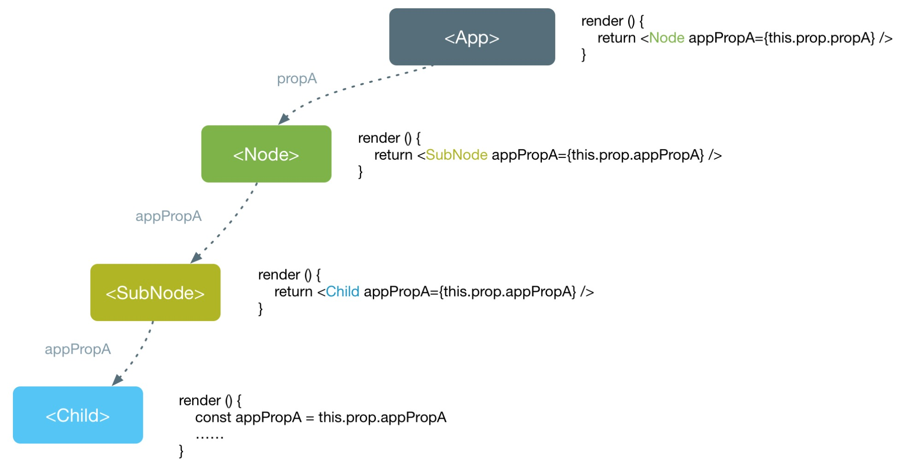

# 一、概述

当你不想在组件树中通过逐层传递 `props` 或者 `state` 的方式来传递数据时，可以使用 `Context` 来实现**跨层级**的组件数据传递。



使用props或者state传递数据，数据自顶下流，使用 `Context`，可以跨越组件进行数据传递，如下所示：


# 二、使用

首先定义一个 context.js 文件

```react
import React from 'react';

const Context = React.createContext();

export default Context;
```

然后在App.js中引用

```react
import React, { useState } from 'react';
import Context from './context'
function App() {
  return (
    <Context.Provider value={{ num: 10, add: function() {this.num++;}}}>
       <div className="App"></div>
    </Context.Provider> 
  );
}
export default App;
```

最后在child.js中

```react
import React from 'react';
import Context from '../../context';

export default class Child extends React.Component {
    static contextType = Context;
    render() {
        console.log(this.context);
        return (
            <div className="child">
                <button onClick={() => {
                    this.context.add();
                    this.forceUpdate();
                }}>{this.context.num}</button>
            </div>

        )

    }
}
```


